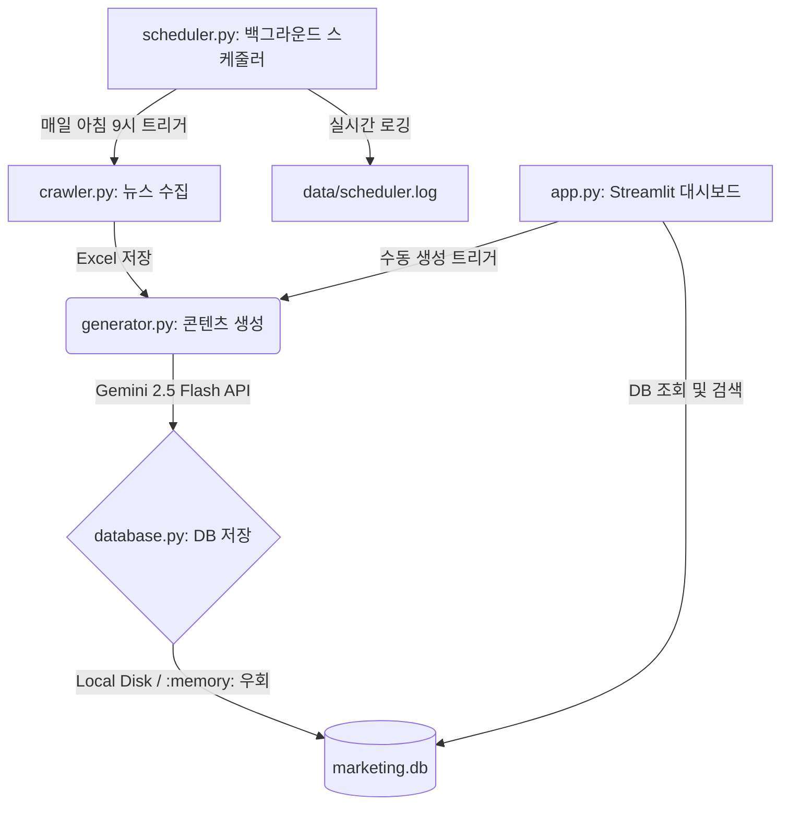

# 🏭 무인 AI 마케팅 팩토리 (SME AI Marketing Factory) 

> **중소기업 대표님들의 디지털 전환과 지속 가능한 성장을 돕는 초고속 뉴스 기반 AI 마케팅 콘텐츠 자동 생성 솔루션**
>
> 본 프로젝트는 최신 IT/AI 트렌드 뉴스를 실시간으로 수집하고, 분석하여 중소기업 경영에 적용 가능한 마케팅 문구(블로그, 인스타그램 릴스, 유튜브 쇼츠) 3종 세트를 자동으로 제작 및 저장하는 완전 무인 자동화 시스템입니다.

---

## 📐 전체 파이프라인 및 아키텍처 구조

시스템은 데이터 수집(Crawler), 콘텐츠 생성(Generator), 데이터 보존(Database), 자동 실행 및 로깅(Scheduler), 시각화 및 관리(Dashboard App)의 5단계 파이프라인으로 긴밀하게 연동되어 작동합니다.



### 📁 핵심 파일 구성 및 역할

1. **`src/crawler.py`**: **실시간 뉴스 크롤러**
   - 네이버 뉴스 및 구글 뉴스 API/웹 페이지를 통해 지정된 키워드(예: "중소기업 AI 도입", "중소기업 디지털 전환") 기반의 최신 뉴스를 실시간으로 검색하여 엑셀 파일로 정렬 및 저장합니다.
2. **`src/generator.py`**: **AI 마케팅 콘텐츠 제너레이터**
   - 최신 구글 제미나이(Gemini 2.5 Flash) API를 활용합니다. 수집된 최신 뉴스를 바탕으로 블로그 포스팅, 인스타그램 릴스 대본, 유튜브 쇼츠 시나리오를 각각 최적화된 형식으로 즉각 작성해 줍니다.
3. **`src/database.py`**: **하이브리드 SQLite 커넥터**
   - 생성된 마케팅 콘텐츠 내역(`marketing_history`)을 누적하여 체계적으로 저장합니다.
   - **클라우드 우회 가드**: 배포 서버와 같이 로컬 파일 시스템 쓰기 권한이 제한되는 샌드박스 환경에서는 자동으로 메모리 내 임시 DB(`:memory:`)로 전환하여 크래시를 방지합니다.
4. **`src/scheduler.py`**: **백그라운드 자동화 스케줄러**
   - 매일 아침 지정된 시간(기본값: `09:00`)에 뉴스 크롤링부터 AI 콘텐츠 생성, DB/텍스트 파일 백업까지의 전체 프로세스를 무인으로 연속 실행합니다.
   - 표준 `logging` 모듈을 연동하여 모든 처리 성공 여부 및 에러 기록을 콘솔과 `data/scheduler.log`에 실시간으로 남깁니다.
5. **`src/app.py`**: **Streamlit 통합 관리 대시보드**
   - 직관적이고 미려한 UI로 뉴스 수집 현황 조회, 수동 AI 콘텐츠 생성, 마케팅 문구 즉시 복사 및 편집이 가능합니다.
   - 하단 탭의 **[데이터베이스 히스토리 조회]**를 통해 과거에 발행되었던 콘텐츠들을 날짜/키워드별로 간편하게 검색하고 정렬할 수 있습니다.

---

## 🎯 AI 프롬프트 엔진 핵심 자산화 원칙

우리가 설계한 AI 프롬프트 엔진(`generator.py`)에는 브랜드 가치와 고객의 페르소나가 고도로 녹아나 있습니다. 향후 AI 프롬프트 및 엔진을 수정 및 튜닝할 때도 아래 가이드라인을 반드시 엄수해야 합니다.

### 🌟 브랜드 핵심 가치: 라인프렌즈 (Line Friends)
- **친밀성과 상냥함**: 사용자 및 대표님들에게 친구처럼 가깝게 다가가는 정감 있는 문장 톤앤매너를 유지합니다. 딱딱한 비즈니스 리포트 형식을 배제하고, 공감을 형성하는 일상적인 대화 요소를 삽입합니다.
- **감성적 이모지 활용**: 텍스트의 가독성을 높이고 시각적 친밀감을 주기 위해 문단 곳곳에 상황에 걸맞은 이모지를 풍부하게 녹여냅니다.

### 💡 타겟 페르소나 가이드라인 (중소기업 대표님 대상)
- **'열정'과 '성장' 중심의 접근**: 
  새로운 도전과 디지털 혁신을 향해 끊임없이 나아가는 대표님들의 지치지 않는 **열정**을 응원하고, 실질적인 매출 향상과 지속적인 **성장**을 견인하는 비즈니스 파트너로서 조력합니다.
- **연령 제한 및 편견 단어 전면 배제 (금지 규칙)**: 
  > [!IMPORTANT]
  > 프롬프트 및 매뉴얼 작성 시 *'시니어'*, *'실버'*, *'나이'*, *'고령'* 등 특정 세대를 규정하거나 한계 짓는 어떠한 연령 제한적 단어도 사용해서는 안 됩니다. 
  > 언제나 젊고 역동적인 열정을 발휘하며 디지털 전환의 주역으로서 활약하시는 성장 파트너로 소통합니다.
- **비기술적 직관적 표현**: 
  어려운 인공지능 전문 용어나 IT 업계 은어 대신, 바쁜 일과 중에도 한눈에 직관적으로 이해할 수 있는 비즈니스 효과 중심(비용 절감, 비서 역할, 시간 확보)의 쉬운 단어로 구성합니다.

---

## 🚀 실행 및 배포 방법

### 1. 환경 설정 및 의존성 설치
로컬 실행 전 필요한 패키지를 설치하고 `.env` 환경 변수 파일을 구성합니다.
```bash
# 가상환경 활성화 (Windows 기준)
.\.venv\Scripts\activate

# 의존성 패키지 설치
pip install -r requirements.txt
```

`.env` 파일에 발급받은 Google Gemini API Key를 등록합니다:
```ini
GEMINI_API_KEY=your_actual_gemini_api_key_here
```

### 2. Streamlit 대시보드 웹 앱 실행
```bash
streamlit run src/app.py
```
실행 후 브라우저에서 `http://localhost:8501`로 접속할 수 있습니다.

### 3. 백그라운드 스케줄러 구동 (무인 자동화)
스케줄러는 사용자가 모니터를 끄거나 로그아웃하더라도 백그라운드에서 상시 대기하며 작동 상태를 기록합니다.
```bash
# Windows PowerShell 백그라운드 실행 (로그가 data/scheduler.log에 자동 기록됨)
Start-Process -FilePath ".\.venv\Scripts\python.exe" -ArgumentList "src/scheduler.py" -WindowStyle Hidden
```

### 4. 클라우드 배포 (Streamlit Community Cloud 등)
- GitHub 저장소에 코드를 푸시합니다. (.env, SQLite DB 파일, 엑셀 파일은 `.gitignore`에 등록되어 누출을 사전 차단합니다.)
- Streamlit Cloud 설정 창의 **Advanced settings > Secrets** 탭에 `.env`에 입력했던 변수와 동일하게 복사하여 저장합니다:
  ```toml
  GEMINI_API_KEY = "AQ.your_secrets_key"
  ```

---

## 🛡️ 시스템 운영 및 셧다운(Shutdown) 프로세스

현재 시스템이 무인 가동 중일 때, 작동 상태를 모니터링하거나 정상적으로 종료하기 위해 아래 명령어를 활용합니다.

### 1. 로그 파일 상시 모니터링 (실시간 로그 추적)
```powershell
# PowerShell에서 로그가 갱신될 때마다 화면에 바로 출력
Get-Content -Path "data/scheduler.log" -Wait -Tail 20
```

### 2. 실행 중인 프로세스 셧다운 (정지 프로토콜)
스케줄러 또는 웹 앱을 수동으로 중단하고자 할 때 사용합니다.
```powershell
# 실행 중인 모든 streamlit 관련 파이썬 프로세스 완전히 종료
taskkill /f /im python.exe
```

---
*본 프로젝트는 최고의 파트너 AI 에이전트와 대표님의 긴밀한 페어 프로그래밍을 통해 완성되었습니다. 대표님의 비즈니스가 AI 팩토리를 타고 끝없이 성장하기를 열렬히 응원합니다!* 🚀
